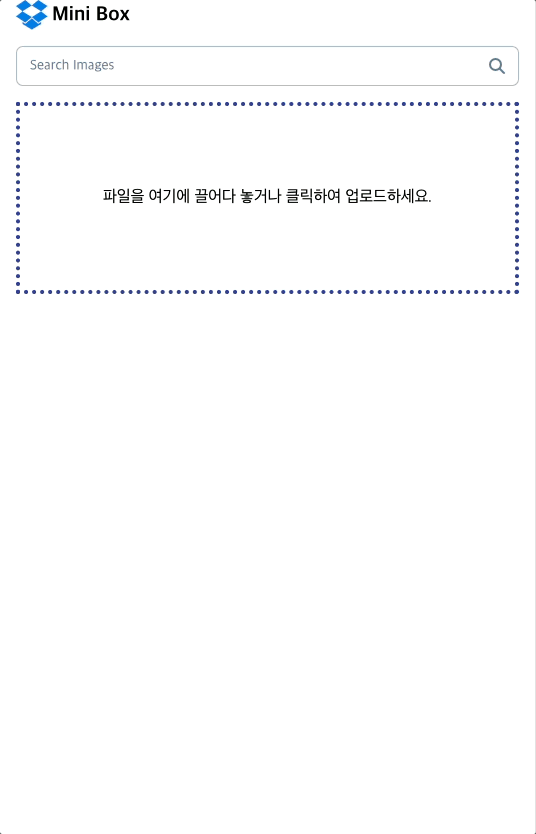
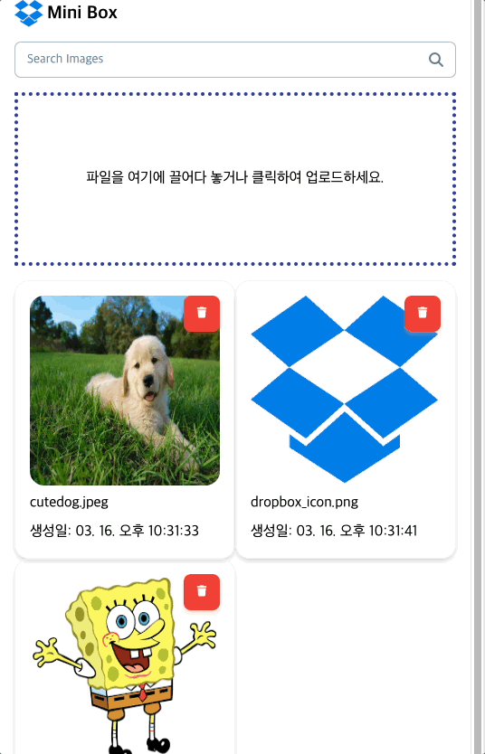

# 📂 Inflearn Supabase Dropbox Clone

Next.js 14을 활용한 **Dropbox 클론 애플리케이션**  
Supabase를 이용해 파일 업로드, 삭제, 조회 기능을 구현함.

---

## 🚀 **기술 스택**

### **Frontend**

- **Next.js 14** 🔹 _Server Actions 활용_
- **[Material Tailwind CSS](https://www.material-tailwind.com/)** 🔹 _UI 및 스타일링_
- **TypeScript** 🔹 _안정적인 타입 시스템_

### **Backend**

- **Supabase** 🔹 _파일 스토리지 및 데이터 관리_

### **State Management & API**

- **React Query** 🔹 _비동기 데이터 관리 및 캐싱_
- **Next.js Server Actions** 🔹 _서버에서 직접 API 호출_

---

## 📌 **주요 기능**

✔️ **파일 드래그 & 드롭 업로드 지원**  
✔️ **업로드된 파일 목록 조회**  
✔️ **파일 삭제 기능**  
✔️ **파일 업로드 후 자동으로 최신 목록 반영**  
✔️ **Supabase Storage 연동**  
✔️ **반응형 UI 지원**

---

## 🎬 **시연 예제 (Demo)**

### ✅ **파일 업로드 & 삭제 시연**

### ✅ **파일 검색 & 업데이트 시연**

---
